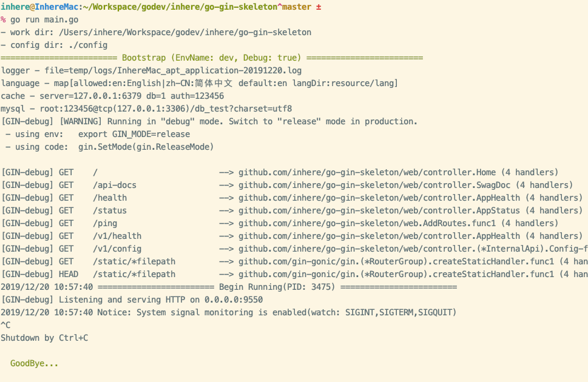

# go-gin-skeleton

使用golang gin框架的应用骨架

- cmd CLI命令行应用
- web web应用,API接口应用

启动预览：



## 依赖库

- gin框架: [gin-gonic/gin](https://github.com/gin-gonic/gin) 
- toml配置：[gookit/config](https://github.com/gookit/config)
- 日志记录：[go.uber.org/zap](https://github.com/uber-go/zap)
- 日志记录：[sirupsen/logrus](https://github.com/sirupsen/logrus)
  - https://github.com/rifflock/lfshook
- mysql等：[go-xorm/xorm](https://github.com/go-xorm/xorm)
- mongodb: [github.com/globalsign/mgo](https://github.com/globalsign/mgo)
- cache, redis: [garyburd/redigo](https://github.com/garyburd/redigo/redis)
- language: [gookit/i18n](https://github.com/gookit/i18n)
- 表单数据验证:
  - [gookit/validate](https://github.com/gookit/validate)
  - [go-playground/validator](https://github.com/go-playground/validator)
- 高性能的json序列化库: [json-iterator/go](https://github.com/json-iterator/go) 
- ~eureka client: [PDOK/go-eureka-client](https://github.com/PDOK/go-eureka-client)~ 未使用

### 辅助库

- swagger 文档生成：可以使用go-swagger 或者 [swaggo/swag](https://github.com/swaggo/swag)
- stretchr/testify 测试辅助库，方便快速断言 [stretchr/testify](https://github.com/stretchr/testify)
  - 常用的是它的断言包 `github.com/stretchr/testify/assert`
    
## 额外组件

- swagger UI: swagger文档渲染
- Dockerfile: 可用于生产环境的docker镜像构建脚本，基于alpine，构建完成一个项目镜像估计大小为：30 M 左右
- Makefile: 已经内置一些快速使用的make命令，帮助快速生成文档，构建镜像

## 开始使用

- 首先，将骨架clone下来，重命名 `go-gin-skeleton` 目录为你的项目名
- 进入到项目，将项目中 `github.com/inhere/go-gin-skeleton` 替换为你的项目名(针对go文件)
- 再搜索将所有的`go-gin-skeleton`替换为你的项目名（主要是Dockerfile,makefile里）
- 运行 `go mod tiidy` 安装依赖库
- 运行项目：`go run main.go`

## 开发说明

配置读取：

```go
name := app.Config.String("name")

// 映射数据到结构体
err := app.Config.MapStruct("db", &dbConfig)
```

## swagger文档生成

安装：

```bash
go get -u github.com/swaggo/swag/cmd/swag
```

> 使用请查看 `swaggo/swag` 的文档和示例

生成到指定目录下：

```bash
swag init -o static
# 同时会生成这个文件，不需要的可以删除掉
rm static/docs.go
```

注意：

> `swaggo/swag` 是从字段的注释解析字段描述信息的

```go
type SomeModel struct {
	// the name description
	Name   string `json:"name" example:"tom"`
}	
```

## 使用帮助

- 运行测试

```bash
go test
// 输出覆盖率
go test -cover
```

- 格式化项目

```bash
go fmt ./...
```

- 运行GoLint检查

> 需先安装 GoLint

```bash
golint ./...
```

## License

**MIT**
